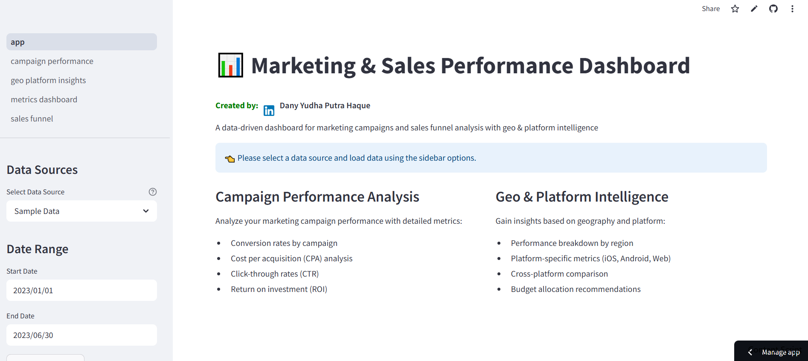

# Marketing & Sales Performance Dashboard



Comprehensive dashboard for marketing and sales performance analysis with geo and platform intelligence, providing actionable insights for optimizing campaign ROI.

## Features

- **Campaign Performance Analysis**: Track and analyze marketing campaign metrics across different dimensions
- **Sales Funnel Visualization**: Monitor conversion rates at each stage of the sales funnel
- **Geo & Platform Intelligence**: Compare performance across different regions and platforms
- **KPI Metrics Dashboard**: Real-time visualization of key performance indicators
- **Multi-source Data Integration**: Connect with various data sources (database, Excel, AppsFlyer)

## Project Structure

```
├── app.py                     # Main Streamlit application entry point
├── database.py                # Database connectivity and query functions
├── data_processing.py         # Data transformation and calculation functions
├── appsflyer_integration.py   # AppsFlyer API integration
├── visualization.py           # Visualization components and charts
├── utils.py                   # Utility functions and helpers
├── pages/
│   ├── campaign_performance.py  # Campaign analysis dashboard
│   ├── sales_funnel.py          # Sales funnel visualization
│   ├── geo_platform_insights.py # Geographic and platform analysis
│   └── metrics_dashboard.py     # KPI metrics and analytics
└── .streamlit/
    └── config.toml            # Streamlit configuration
```

## Key Components

1. **Data Integration Layer**
   - PostgreSQL database connection
   - AppsFlyer API integration
   - Excel file import capabilities
   - Sample data generation for testing

2. **Data Processing Engine**
   - Campaign performance calculations
   - Sales funnel conversion metrics
   - Geographic aggregation
   - Platform-specific analysis

3. **Visualization Framework**
   - Interactive time-series charts
   - Comparative bar and pie charts
   - Geographic heatmaps
   - KPI metric cards

4. **Analytics Dashboard**
   - Campaign comparison
   - ROI calculation
   - Conversion rate analysis
   - Cost per acquisition tracking

## Key Metrics

The dashboard tracks and analyzes the following key metrics:

- **Conversion Rate**: Percentage of users who complete a desired action
- **Cost Per Acquisition (CPA)**: Average cost to acquire a customer
- **Customer Lifetime Value (CLTV)**: Predicted revenue from a customer
- **Return on Investment (ROI)**: Net profit relative to investment
- **Click-Through Rate (CTR)**: Percentage of impressions that result in clicks
- **Average Revenue Per User (ARPU)**: Average revenue generated per user

## Geographic & Platform Intelligence

A distinctive feature of this dashboard is the "Geo & Platform Intelligence Layer" that provides:

- Performance comparison across regions
- Device-specific metrics (iOS, Android, Web)
- Platform efficiency ratios
- Regional market opportunity analysis
- Budget allocation optimization by platform

## Usage

The application runs on Streamlit and provides an interactive interface for:
- Filtering data by date range, campaign, platform, or region
- Comparing performance across different dimensions
- Analyzing time-series trends
- Exporting data for further analysis

## Data Sources

The dashboard supports multiple data sources:
- PostgreSQL database
- AppsFlyer API
- Excel file upload
- Sample data generation

## Getting Started

1. Install required packages:
   ```
   pip install streamlit pandas plotly numpy sqlalchemy statsmodels requests
   ```

2. Configure database connection in `.streamlit/secrets.toml` (optional)

3. Run the application:
   ```
   streamlit run app.py
   ```

## Customization

The dashboard can be customized for specific business needs:
- Add new metrics by extending the data processing module
- Create custom visualizations in the visualization module
- Integrate additional data sources by implementing new connectors
- Customize the UI by modifying the Streamlit components

## Future Enhancements

Planned improvements include:
- Predictive analytics for campaign performance
- AI-powered recommendations for budget allocation
- Advanced attribution modeling
- Real-time data integration
- Custom report generation